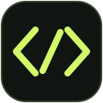
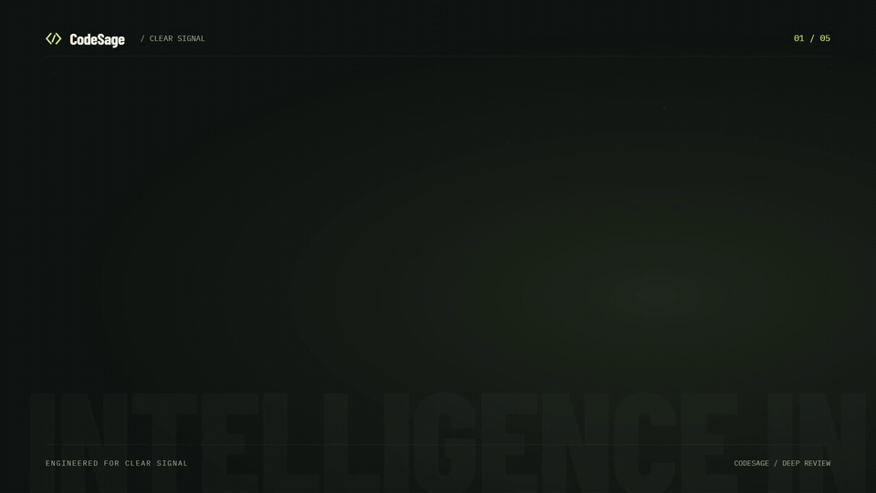
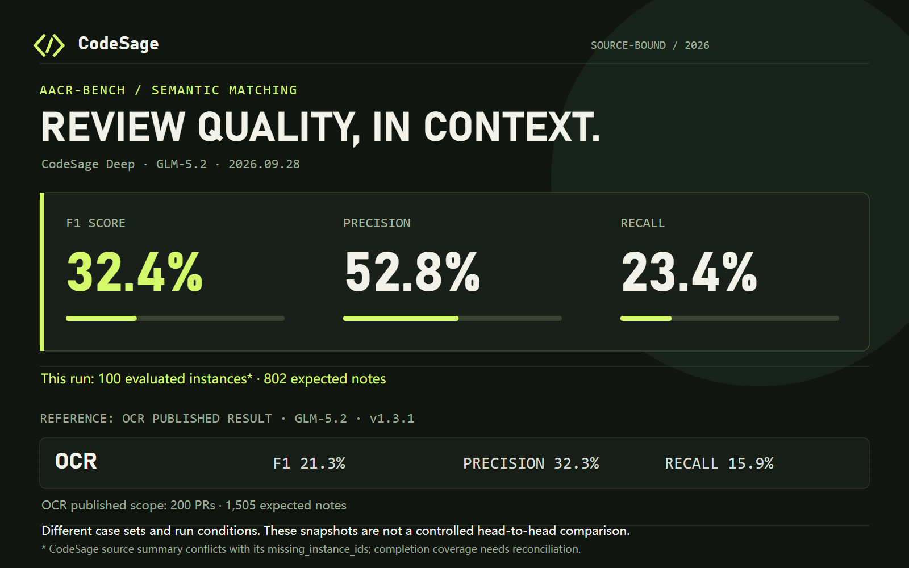
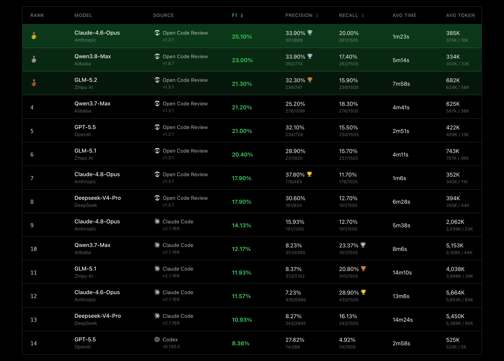

<div align="center">
  
  <h1>CodeSage</h1>
  <p><strong>Code review findings grounded in code and evidence.</strong></p>
  <p>Pull request review · Reliable task execution · Multi-perspective deep review</p>
  <p><a href="README.md">简体中文</a> · English</p>
</div>

---

[](assets/media/codesage-showreel.mp4)

<div align="center">
  <a href="assets/media/codesage-showreel.mp4">▶ Watch the full 1080p video with sound</a> ·
  <a href="assets/media/codesage-showreel/README.md">Explore the editable motion project</a>
</div>

## What is CodeSage?

CodeSage is an AI-powered code review tool with a local CLI and a companion web product. Its **CodeSage Deep** workflow goes beyond summarizing a Git diff: it investigates the intent of a change, builds a review plan, runs focused Reviewers in parallel, and verifies their findings against code evidence and cross-file behavior before returning structured, code-located comments.

Agents can read complete files, inspect other changes, search the repository, and follow the surrounding code to understand a potential issue. Plans assign investigation work rather than prescribe how many bugs to find. Final verification challenges candidate findings, considers benign explanations, and checks duplicates and compound risks across files to reduce unsupported feedback.

CodeSage aims to balance review quality, speed, and cost. Deterministic code handles filtering, evidence extraction, and result assembly; models handle interpretation and reasoning. Configure a model endpoint to get started. Alongside the final findings, stage outputs and tool-call records show how each conclusion was reached.

## Benchmarks

In this **100-instance** [AACR-Bench](https://huggingface.co/datasets/Alibaba-Aone/aacr-bench) evaluation, CodeSage Deep with **GLM-5.2** reports **52.8% precision, 23.4% recall, and 32.4% F1**. It produced 356 comments, of which 188 matched reference comments. The charts below show the current snapshot; aggregate metrics and per-instance outputs are public.



The original OCR benchmark chart is also included for reference:



Image source: [Open Code Review](https://github.com/alibaba/open-code-review/blob/main/imgs/benchmark-en.png). This CodeSage summary covers 100 instances and 802 reference comments; the OCR chart covers 200 PRs and 1,505 reference comments. Their sample sets differ.

Evaluation files: [raw metrics](aacr-bench-main/evaluation/metrics/aacr_bench/codesage_deep/deep-GLM-5.2/metrics_codesage_deep_20260928_085915.json) · [100 per-instance results and input snapshot](aacr-bench-main/evaluation/results/aacr_bench/codesage_deep/deep-GLM-5.2/) · [evaluation entry points](aacr-bench-main/evaluation/). Missing-instance counts differ between the summary and run metadata; see the [architecture guide](architecture/README.en.md#reports-and-execution-history).

## Design strengths

| Design | What it provides |
| --- | --- |
| Deterministic preparation | Fixed Git snapshots, file filtering, change statistics, and Python import impact analysis provide concrete investigation entry points. |
| Repairable review plans | The Planner assigns investigations; code merges contained dimensions, preserves their questions, fills file-coverage gaps, and maintains cross-dimension relationships. |
| Controlled parallel Reviewers | A shared concurrency limit, file-count-based turn budgets, and independent sessions keep investigations bounded. Evidence tracing and comment worthiness share the same review pass. |
| One Cross verification session | All candidates and deduplicated local evidence support verification, adversarial challenge, consistency checks, duplicate decisions, and compound-risk analysis. |
| Deterministic final assembly | Location validation, accepted decisions, exact deduplication, severity filtering, and stable ordering produce final and process reports. |
| Product task governance | ARQ delivery, database row locks, leases, heartbeat renewal, and a result-acceptance gate constrain execution ownership. Lifecycle services coordinate cancellation and resume. |

Follow a review from task delivery through planning, parallel investigation, and evidence verification in the [English architecture guide](architecture/README.en.md) / [中文架构说明](architecture/README.md).

## Using CodeSage

### Local Deep Review

Install Python 3.11+ and Git. Configure the model endpoint in `backend/.env`:

```dotenv
LLM_PROVIDER=openai
LLM_BASE_URL=https://your-model-endpoint/v1
LLM_MODEL=your-model-name
LLM_API_KEY=your-api-key
LLM_FINALIZER_CAPABILITY=auto
```

From the repository root, enter the backend and run a full review:

```powershell
Set-Location backend
python -m pip install -e .
$repo = (Resolve-Path ..).Path
$base = (git -C $repo rev-parse HEAD~1).Trim()
$head = (git -C $repo rev-parse HEAD).Trim()
python -m app.domains.deep_review --repo $repo --base $base --head $head --through final --allow-model-calls --output ../.codesage/deep-review/result.json --store-dir ../.codesage/deep-review
```

Replace `$base` and `$head` with the Git refs to inspect. For deterministic preparation only, use `--through anatomy` and remove `--allow-model-calls`. The `planning`, `review`, `cross`, and `final` stages invoke real models.

Each run creates `<store-dir>/<run_id>/` with `result.json`, a stage-by-stage `process_report.json`, and `events.jsonl`. The full command above also writes `sessions.sqlite3` and `summary.json` beside the requested output. `--output` selects a report copy. Run `python -m app.domains.deep_review --help` for filtering, concurrency, and configuration options.

### Web product and Workers

Use Docker Desktop in Linux-container mode. From the repository root:

```powershell
Copy-Item .env.example .env
# Set POSTGRES_PASSWORD, SECRET_KEY, and LLM_* configuration
docker compose up -d --build --wait
```

Open the [web UI](http://127.0.0.1:3000), [API](http://127.0.0.1:8000), and [Phoenix](http://127.0.0.1:6006). Workers use the Docker socket for sandbox tools. `docker compose ps` checks service status; `docker compose down` stops services while preserving volumes. The isolated evaluation services use the `eval` profile; see [docker-compose.yml](docker-compose.yml).
