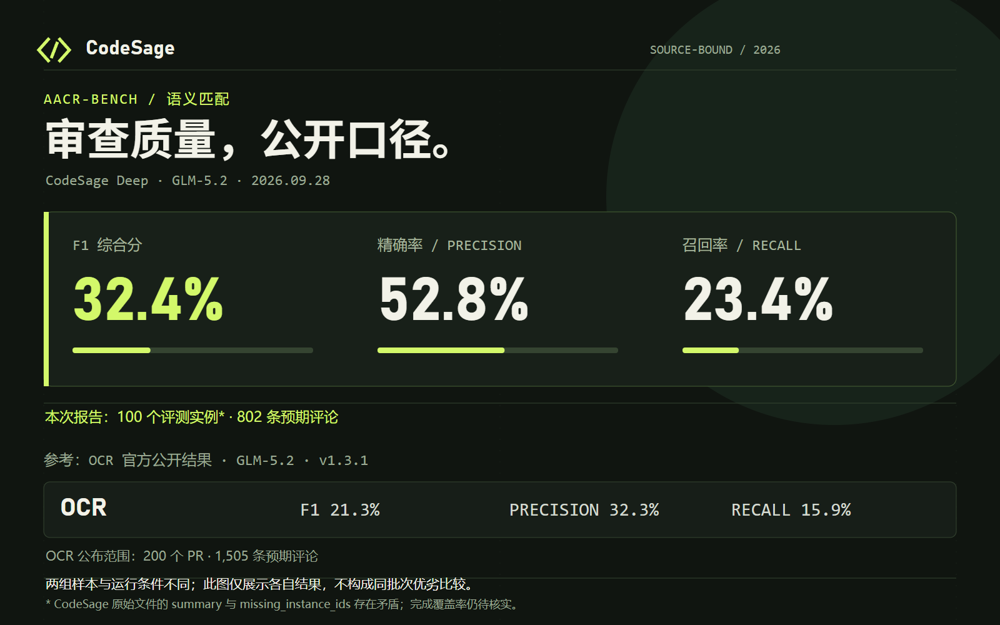

<div align="center">
  
  <h1>CodeSage</h1>
  <p><strong>让每条审查意见，都经得起代码与证据的检验。</strong></p>
  <p>面向 Pull Request 的代码审查平台 · 可靠任务执行 · 多视角深度审计</p>
  <p>简体中文 · <a href="README.en.md">English</a></p>
</div>

---

[](assets/media/codesage-showreel.mp4)

<div align="center">
  <a href="assets/media/codesage-showreel.mp4">▶ 观看完整视频（1080p · 含声音）</a> ·
  <a href="assets/media/codesage-showreel/README.md">查看可编辑动画工程</a>
</div>

## CodeSage 是什么？

CodeSage 是一款 AI 驱动的代码审查工具，提供本地 CLI 和配套 Web 产品。它的深度审查能力 **CodeSage Deep** 不止解释 Git diff，而是围绕一次变更展开调查：理解 PR 的意图，制定审查计划，让多个 Reviewer 并行检查不同问题，再对发现进行证据核验和跨文件分析，输出定位到代码的结构化审查意见。

审查过程中，Agent 可以读取完整文件、查看其他文件的差异、搜索仓库，并沿调用关系追查上下文。计划用于分配调查工作，而不是预设应该发现多少个问题；最终验证会质疑候选结论，检查无害解释、重复问题和跨文件组合风险，尽量减少缺乏依据的评论。

CodeSage 希望在审查效果、速度和成本之间取得平衡：文件筛选、证据提取和结果整理交给确定性代码，需要理解和推理的部分再调用模型。只需配置模型端点即可运行；除了最终意见，还能查看逐阶段输出与工具调用记录，了解每条结论是如何形成的。

## 基准测试

在 [AACR-Bench](https://huggingface.co/datasets/Alibaba-Aone/aacr-bench) 的这次 **100 个实例**评测中，CodeSage Deep 搭配 **GLM-5.2** 获得 **52.8% 精确率、23.4% Recall 和 32.4% F1**。审查生成了 356 条评论，其中 188 条匹配参考评论。以下图表展示当前结果，原始指标和单例输出均已公开。



OCR 官方公开结果也直接展示在下方，方便了解不同模型与工具的表现：


图片来源：[Open Code Review](https://github.com/alibaba/open-code-review/blob/main/imgs/benchmark-en.png)。CodeSage 本次汇总包含 100 个实例、802 条参考评论；OCR 公开图覆盖 200 个 PR、1,505 条参考评论，两者样本范围不同，图中数值用于参考。

评测文件：[原始指标](aacr-bench-main/evaluation/metrics/aacr_bench/codesage_deep/deep-GLM-5.2/metrics_codesage_deep_20260928_085915.json) · [100 个单例结果与输入快照](aacr-bench-main/evaluation/results/aacr_bench/codesage_deep/deep-GLM-5.2/) · [评测运行入口](aacr-bench-main/evaluation/)。指标汇总与运行元信息的缺失实例统计尚有差异，具体口径见[架构说明](architecture/README.md#报告与运行记录)。

## CodeSage 的设计优势

| 设计 | 为审查与产品带来的帮助 |
| --- | --- |
| 确定性准备 | 固定 Git 快照、目录过滤、变更统计和 Python import 影响分析，为 Agent 提供可核查的调查入口。 |
| 可修复的审查计划 | Planner 划分调查工作；代码合并被包含的维度、保留调查问题、补齐遗漏文件，并维护跨维度关系。 |
| 受控并行 Reviewer | 共享并发限制、按文件规模分配轮次、独立调查会话；提示词将证据追查与评论价值判断放在同一轮审查中。 |
| 一次 Cross 综合验证 | 用全部候选与去重后的局部证据，完成证据核验、对抗挑战、一致性检查、重复判断与复合风险分析。 |
| 确定性收尾 | 校验位置、接纳裁决、精确去重、严重度过滤和稳定排序；同时保存最终报告与过程报告。 |
| 产品任务治理 | ARQ 投递、数据库行锁、Lease、心跳续约与提交门禁共同约束有效执行者；取消和恢复统一经过任务生命周期服务。 |

从任务投递到审查计划、并行调查与证据验证，见[中文架构说明](architecture/README.md) / [English architecture guide](architecture/README.en.md)。

## 使用 CodeSage

### 本地 Deep Review

准备 Python 3.11+ 和 Git。在 `backend/.env` 中配置模型端点：

```dotenv
LLM_PROVIDER=openai
LLM_BASE_URL=https://your-model-endpoint/v1
LLM_MODEL=your-model-name
LLM_API_KEY=your-api-key
LLM_FINALIZER_CAPABILITY=auto
```

从项目根目录进入后端并运行完整审查：

```powershell
Set-Location backend
python -m pip install -e .
$repo = (Resolve-Path ..).Path
$base = (git -C $repo rev-parse HEAD~1).Trim()
$head = (git -C $repo rev-parse HEAD).Trim()
python -m app.domains.deep_review --repo $repo --base $base --head $head --through final --allow-model-calls --output ../.codesage/deep-review/result.json --store-dir ../.codesage/deep-review
```

将 `$base` 和 `$head` 换成要审查的两个 Git ref。先检查确定性准备结果时，使用 `--through anatomy` 并移除 `--allow-model-calls`；`planning`、`review`、`cross` 和 `final` 会调用真实模型。

每次运行会创建新的 `<store-dir>/<run_id>/`，保存 `result.json`、逐阶段 `process_report.json` 和 `events.jsonl`；上述完整命令还会在输出目录写入 `sessions.sqlite3` 与 `summary.json`。`--output` 是一份指定名称的报告副本。运行 `python -m app.domains.deep_review --help` 查看筛选、并发和配置选项。

### Web 产品与 Worker

使用 Docker Desktop 的 Linux 容器模式，在项目根目录执行：

```powershell
Copy-Item .env.example .env
# 设置 POSTGRES_PASSWORD、SECRET_KEY 和 LLM_* 配置
docker compose up -d --build --wait
```

打开 [Web 界面](http://127.0.0.1:3000)、[API](http://127.0.0.1:8000) 和 [Phoenix](http://127.0.0.1:6006)。Worker 通过 Docker socket 运行沙箱工具；`docker compose ps` 查看状态，`docker compose down` 停止服务并保留数据卷。独立评测服务位于 `eval` profile，服务定义见 [docker-compose.yml](docker-compose.yml)。
