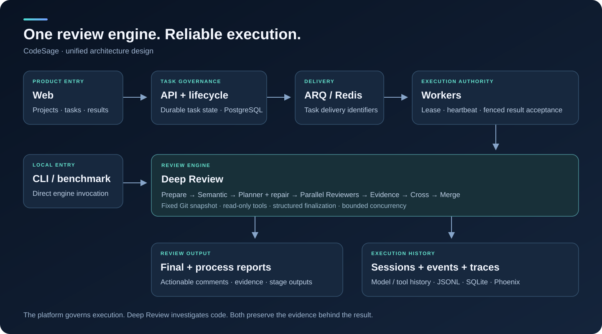
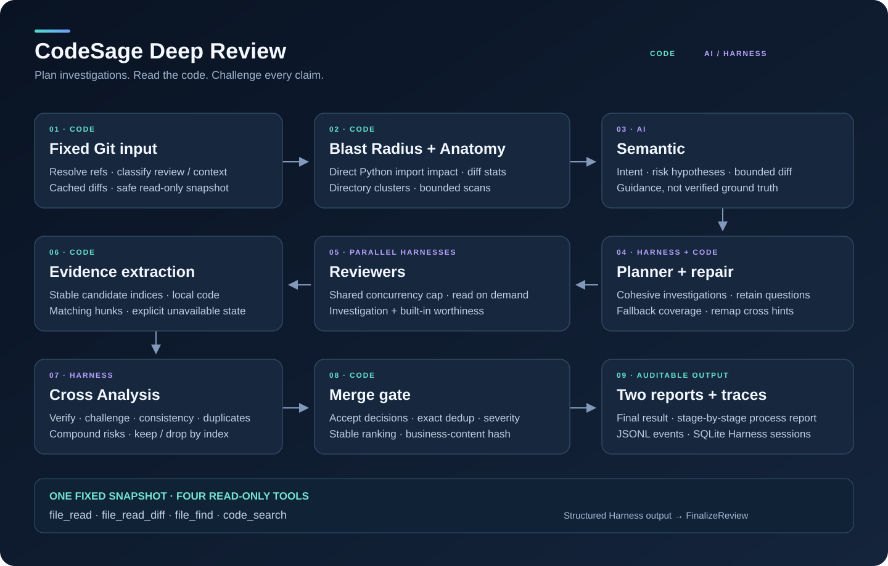

# CodeSage architecture

[简体中文](README.md) · [Back to the project](../README.en.md)

CodeSage brings together two parts of code review: a platform that executes work reliably, and Deep Review, which investigates the change. The Web application provides project and task entry points. A queue delivers work to Workers. The review engine reads code, develops findings, checks the evidence, and returns the results.

This article follows that unified architecture. Connecting Deep Review to the Web / Worker execution path is in progress; the integrated view below describes how the components fit together.

## From a review request to a result

A developer submits a repository and two versions to compare. The platform saves the task and delivers it through ARQ. A Worker claims execution authority, starts the review, renews its lease while running, and passes the commit gate before saving results. The Web application presents progress and comments. The local CLI calls the review engine directly for debugging, scripts, and benchmarks.

Each component has a distinct job. The API does not host long model conversations. The queue does not decide who may commit a result. Worker does not determine whether a code finding is correct. Deep Review takes fixed code versions and review configuration without needing to know whether the request came from Web or a terminal.

Consider a PR moving authentication from route functions into shared middleware, with changes to route registration and tests. Reading only the new middleware can make the migration look complete. The useful questions are elsewhere: does every protected route use it? Did error handling change how access is denied? Do the tests exercise the routes used by the deployment entry point? Deep Review turns these questions into investigations that can be checked against code.

## Prepare the code before asking the model

A review uses fixed base and head commits throughout. Worktree changes during execution do not cause one Reviewer to read a different version. Diffs are parsed at the start and kept in memory; file reads and searches use the same Git snapshot.

Directory filtering separates changed files to review, supporting context, and excluded content. Generated files, binaries, and sensitive paths should not consume investigation time. The remaining files are organized by directory, change size, test changes, and possible relationships.

Anatomy turns that information into a change overview. Blast Radius adds dependency leads: for Python changes, it analyzes imports to identify files that directly depend on changed modules. In the authentication example, an unchanged caller may still be essential to understanding the new behavior. These steps run in code, without asking a model to count files or reconstruct directory relationships.

Semantic then reads the PR description, commit messages, structural overview, and bounded diff excerpts to produce a short intent analysis. It helps the next stages understand what the change is trying to do and where to ask questions. It remains a set of leads: a PR claiming to unify authentication has not thereby proved that every route is protected.

## Planner assigns investigations, not predicted bugs

Planner organizes the change into cohesive investigations. Each dimension describes target files, supporting context, questions, and priority. Related files can stay together instead of being assigned mechanically one file at a time.

For the authentication PR, one dimension might examine rejection behavior, another route registration, and another the relationship between tests and deployment configuration. That is not a requirement to find three bugs. Each is a question to investigate; a valid outcome may be a finding or evidence that the suspicion was wrong.

Target files establish the Reviewer's assigned scope. Context files help it understand callers and conventions. Priority orders the work; it is not defect severity. Planner can also leave cross-dimension leads, such as comparing route registration with the deployment entry point, for Cross to investigate.

Code checks the proposed plan before execution. Invalid paths are rejected, omitted files receive a general review, and oversized tasks are split. Duplicate dimensions need more care: deleting one of two overlapping tasks can also delete a useful investigation question.

CodeSage merges a later task only when one retained dimension contains its entire target set, preserving its questions and context. An investigation covering middleware and route registration can absorb a later middleware-only question. But a middleware-only task and a task covering middleware, registration, and the deployment entry point remain separate: the latter needs the full cross-file context. Name mappings follow the repair so Cross leads still point to the right investigations.

This permits purposeful overlap without creating many Reviewers for identical scope. The plan starts the investigation; it neither supplies the conclusion nor limits what Reviewer may discover.

## Reviewers investigate and judge comment worthiness together

Each Reviewer has an independent conversation. It reads its target diffs and uses tools to investigate further. A shared concurrency limit controls parallel work, while file-count-based turn budgets give larger tasks more room without assigning the same cost to every dimension.

All roles use four simple read-only tools:

| Tool | Purpose |
| --- | --- |
| `file_read` | Read a file excerpt from the fixed head. |
| `file_read_diff` | Read a cached file diff. |
| `file_find` | Find paths by filename. |
| `code_search` | Search the fixed version using literals or regular expressions. |

Reviewer does more than check off Planner's questions. It identifies a concrete trigger, checks whether the relevant branch is reachable, traces callers and consumers, and considers the strongest benign explanation. A claim that a route bypasses authentication needs the actual registration and middleware relationship, not just a function without an authentication call.

Comment worthiness is assessed during the same investigation. Reviewer explains the location, trigger, consequence, and a direct repair direction. Naming, documentation, and style are not automatically excluded, but they still need specific evidence and practical value. This avoids another model stage rereading the same material simply to decide whether a comment is worth posting.

Candidates pass structure and location checks before aggregation. Overlong prose is truncated rather than discarding a Finding solely for length. If one Reviewer fails, the other outputs remain, and the process report records which investigations did not finish.

## Cross checks local findings against the whole change

Parallel review is good at investigating local behavior, but its conclusions can duplicate one another or lack evidence from the other end of a contract. Reviewer outputs are therefore candidates, not immediately final comments.

Code extracts nearby source and matching change hunks, then assembles the Cross input. Every candidate is retained and linked to evidence through a stable index; shared hunks are sent once. A file-level claim without a line receives an explanation of why no hunk could be matched, not a fabricated location.

Cross receives the claims, necessary change evidence, cross-dimension leads, and review coverage. It does not receive the full Semantic narrative, Plan, or every Reviewer conversation. Those helped the investigations; carrying them forward wholesale adds repetition and lets early guesses anchor adjudication. Cross reads additional source through the same tools when needed.

This pass checks whether evidence supports a claim, whether the strongest benign explanation holds, whether producer and consumer contracts agree, whether candidates share a root cause, and whether several observations combine into a distinct new risk.

In the authentication example, one Reviewer may suspect that an error branch allows access, while another finds routes without middleware. Cross verifies each claim and determines whether they describe the same defect. It can also examine a deployment entry point using a different registration path, connecting evidence that local investigations left separate.

Cross returns keep or drop decisions by index, with reasons and any severity changes. New compound findings are returned separately. Missing decisions do not silently erase candidates; a drop requires a reason. Verification failures leave unresolved risks and a partial status rather than describing unverified scope as safe.

## Models investigate; code sets the boundaries

Deep Review uses models for intent and behavioral investigation, and deterministic code for filtering, coverage repair, evidence extraction, location checks, and result assembly. Turning every operation into an Agent adds latency, repeated context, and failure points without automatically improving review quality.

Semantic is one structured generation. Planner, Reviewer, and Cross use a Harness: the model can make multiple tool calls before submitting a schema-conforming result through `FinalizeReview`. Finalization has its own bounded request path instead of relying on ever-larger turn limits to make the model stop.

Provider compatibility is handled at this boundary. Models supporting forced tool choice while thinking retain the investigation prefix and receive appended finalization instructions. Endpoints with different requirements use a compatibility strategy. The review workflow does not need to be rewritten for each provider, and message construction preserves reusable cache prefixes where possible.

Final assembly does not ask another model to rewrite the comments. Code applies Cross decisions, cleans formatting, deduplicates exact matches, ranks findings, and creates stable reports. Each stage has an input scope and output contract; the model investigates within them rather than also controlling task lifecycle, file access, and result submission.

## Why Workers need leases and a commit gate

A deep review can take several minutes. Queue redelivery, Worker restarts, or network interruptions can lead to two executions of one task. Receiving a queue message alone cannot safely authorize both Workers to save results.

CodeSage uses a database lease to determine the current execution owner. Claiming locks the execution row, checks task state and any existing lease, and assigns a new `lease_epoch`. Heartbeats renew only a matching owner and epoch while the lease remains valid and the task has not been cancelled.

Suppose Worker A becomes unresponsive after claiming a task. Its lease expires, and Worker B takes over. A later recovers and finishes its model calls. It still cannot save the result: the commit gate sees A's old epoch and rejects the submission. B's accepted result cannot be overwritten by a late response from the old owner.

Results, stage records, and terminal task state commit in one transaction. Cancellation invalidates execution authority and stops local work; resumed execution uses a new epoch. The platform tracks who may complete the task, not merely which process appears to be running. Model calls already sent can still incur cost; fencing protects accepted results from stale owners.

## Reports and execution history

Readers can approach a review from two directions. The final report is for the developer changing the code: locations, severity, explanations, repair suggestions, and unresolved risks. The process report is for understanding the review: change overview, semantic analysis, Draft and repaired Plan, individual Reviewer outputs, evidence, and Cross decisions.

Session records preserve tool calls and model messages. Stage events and usage explain execution. Low recall can then be investigated: did the plan miss a direction, did Reviewer fail to read a caller, or did Cross incorrectly drop a finding? Slow runs can be checked for repeated reads, invalid tool calls, and finalization retries instead of presenting only a total duration.

Platform tasks and business results use PostgreSQL; ARQ uses Redis; Phoenix receives traces. The local CLI writes review events to JSONL, saves Harness sessions in SQLite, and exports both reports. The fixed source snapshot remains the basis for code reads; execution records and telemetry do not replace it.

AACR-Bench calls the same review engine. Its adapter handles startup, waiting, conversion, and archiving rather than changing review behavior to fit reference answers. The public GLM-5.2 summary records 100 instances with 52.8% precision, 23.4% recall, and 32.4% F1. Those describe end-to-end performance; understanding a particular failure requires its stage outputs and session history. Summary and missing-instance metadata differ in the published artifacts, so comparisons should preserve sample scope.
