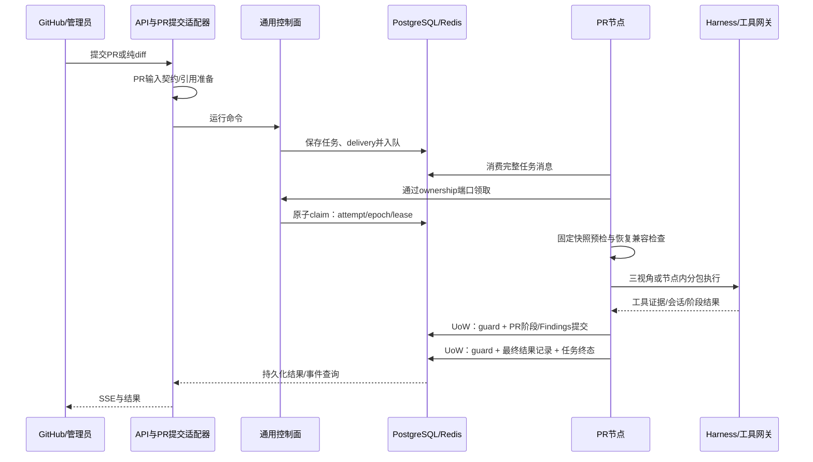
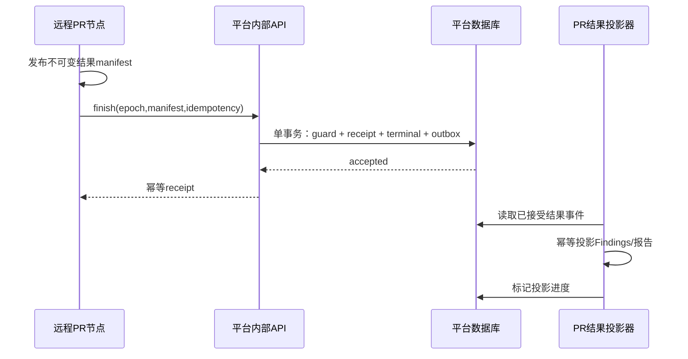

# CodeSage：控制面与 PR 节点目标设计

日期：2026-09-15。状态：设计；不是当前实现说明。实施阶段见 `docs/plan/22-控制平面与PR节点边界重组.md`。

顺序修订：21A → 22A → 22B → 21B → 22C。本文所称“远程化后续阶段”现已确定为21B之后的22C；并非待需求触发的候选。详细协议、恢复manifest及验收以docs/spec/22A、22B、22C和22台账为准。

交互式概览：`22-target.html`。该图展示主要组件关系，未穷举回调、观测和权限连线；以本文数据流和事务规则为准。

## 1. 源码依据和参考边界

CodeSage 检查基线：`b9eebd73027a01218baf60afeb2bdc5bb4619843`。

| 参考源码 | 可以借鉴 | 不应推断 |
|---|---|---|
| `E:/Mac/github/agentfield/control-plane/internal/storage/storage.go`、`models.go` | 执行/节点/身份状态由 storage abstraction 持久化 | 控制面整体不需要状态 |
| `agentfield/sdk/python/agentfield/agent.py`、`agent_field_handler.py` | 节点暴露能力、注册与心跳，控制面与节点协议分离 | SDK 内的模型 Harness 应搬进平台 API |
| `agentfield/control-plane/internal/handlers/workflow_dag.go` | 从父子执行记录恢复调用关系 | 有 DAG 图就有任意阶段 durable resume |
| `agentfield/control-plane/internal/handlers/execute_agent_restart.go` | 请求派发、节点交互边界 | 本地节点启动管理等于云 Fleet 自动扩缩容 |
| `agentfield/control-plane/internal/services/did_service.go`、`vc_issuance.go` | DID、execution/workflow VC 是独立身份能力 | 有 trace/hash 即拥有不可否认性 |
| `E:/Mac/github/pr-af/go/internal/orch/orchestrator.go`、`phases.go` | intake/anatomy/review/coverage/synthesis 属于 PR 节点内部工作流 | CallLocal 执行 DAG 自带 CodeSage 式 lease/checkpoint |
| `pr-af/go/internal/orch/resolve.go`、`harnessx/run.go` | 明确仓库目录和 Harness 调用入口 | 可刷新的 clone 工作区等同不可变 base/head 快照 |

本地审阅未证明这些项目全部运行能力；以上是源码职责比较。CodeSage 现有租约、固定输入、会话恢复与证据门应保留。AgentField 的官方说明也以控制面 + SDK 节点为接口，但本设计以本地实现为第一参照：[AgentField 仓库](https://github.com/Agent-Field/agentfield)。

## 2. 三个控制面模块的实际范围

| 模块 | 本轮职责 | 不归它负责 |
|---|---|---|
| Runtime & API | 身份后的请求接入、run 命令/查询、版本化能力注册、SSE 事件读取 | diff 解析、prompt、模型轮次、会话压缩 |
| Scale & Ops | 任务投递、attempt/lease、取消与恢复命令、并发/积压限制、节点健康 | PR 视角/分包/critic 决策，模型请求级 retry |
| Identity & Audit | 管理员/节点身份、运行能力授权、持久化安全事件、权限拒绝 | 代码漏洞判定，凭 OTel 提供密码学不可否认性 |

这三个模块是代码责任区，初版同一部署单元。共享作用域 memory 若将来跨 Agent 使用，应是有 scope/TTL/授权的 KV 服务；目前 Harness memory/session 属于节点恢复状态，不为“平台必须有 memory”而迁走。

DID/VC 可作为后续实现替换节点认证，不是接口拆分的前置条件。加密审计需要明确签名主体、密钥保管、信任根、时间与防删除机制；本轮只承诺操作审计可关联、权限可执行。

## 3. 节点边界与工具网关

PR 节点包含 PR 输入预检、快照绑定、工具能力选择、三视角、分包/覆盖、证据门和结果生成。node_runtime 提供通用 Harness、SessionStore、LiteLLM、工具执行入口与运行资源限制。

工具网关在节点执行边界：平台授予运行能力上限；节点 PR 策略在此上限内选工具；网关执行路径、快照、调用数、结果大小、超时限制。PR 代码图/MCP adapter 位于节点，不能通过远程 MCP 绕过本地授权。

读取未修改文件允许，但只能从本次固定 base/head 快照读取。MCP 查询必须绑定 snapshot/index version，返回结构化分页结果、来源和截断信息。大图结果落产物，仅取有预算的相关片段给模型。平台不缓存整个代码图作为运行元数据。

## 4. 身份与最小跨边界契约

以下为设计字段；优先复用现有契约，不新增第二份权威 ID。

| 契约 | 必需信息 | 规则 |
|---|---|---|
| RunCommand | schema_version、task_id、agent_type、entrypoint、agent_version、delivery_id、input_ref、deadline、能力授权引用、trace carrier | task_id 延续已有任务 ID；未知 agent/entrypoint 拒绝；不接受任意导入路径 |
| AttemptContext | task_id、attempt_id、node_id、lease_epoch、lease_expires_at、delivery_id | 领取后产生，数据库时间判断 lease；不能由客户端任意指定 |
| PR InputManifest | ReviewRunIdentity、diff 引用、固定仓库版本、review_mode、capabilities、配置指纹 | 由 PR 单点输入准备生成；resume 不重建 run_id |
| ResultSubmission | schema_version、task_id、attempt_id、epoch、idempotency_key、result_schema、manifest_ref、业务状态摘要 | 结果主体由 PR 验证；平台验证归属/epoch/cancel/引用完整性 |
| SubmissionReceipt | receipt_id、task_id、attempt_id、epoch、accepted_at、manifest_hash | 重试返回同一接受结果；失效 epoch 拒绝，不复活已取消任务 |

`task_id` 是当前平台任务标识，`ReviewRunIdentity.run_id` 是当前审查身份标识，两者可能不同；通过显式映射关联。未来 AgentRun 命名变更不得隐式合并它们。

队列引用可以指向受控记录/产物；原始完整 diff 可通过产品输入适配器接收并存储，但不能反复嵌进通用投递信封。秘密凭据由服务装配或授权通道提供，不写进输入身份、trace carrier 或消息正文。

## 5. 22A/22B 数据流与事务

图中节点调用控制面端口在 22A/22B 可由同库适配器实现，不代表已经有远程 HTTP 服务。物理运行模型为“API 进程 + 两个独立 PR worker + 共享 PostgreSQL/Redis/本地产物目录”。

细则：

1. 业务输入验证只有 PR 单点实现；提交阶段做契约/可用性检查，执行前再验证节点可访问快照，不能依赖提交进程曾看到某路径。
2. 入队不是与 PostgreSQL 同一个事务；delivery 持久化后可重试，增加确定性投递恢复扫描或复用已有等价机制，不能宣称两个系统原子提交。
3. 文件写入也不属于 DB 事务：先写临时文件、校验并发布不可变内容，再在结果事务引用。回滚可留下不可见孤儿产物，受限清理；绝不能先 completed 后写最终文件。
4. PR 结果服务先验证完成门禁，UoW 在同一事务检查有效 owner、取消状态，写阶段/Findings/终态。早已提交的阶段保留；本次提交失败不得留下完成终态。
5. FAILED/cancelled 可保留已提交部分 Findings。它们标注 partial 与 attempt/stage 来源；无 final artifact 是允许状态。只有最终完成的业务投影要求 final manifest 与最终 Findings 一致；不能要求失败态存在最终产物。
6. 运行事件持久化与终态一致性由事务保障；SSE 传输/OTel 导出不是结果提交成功的条件。

## 6. 取消、恢复和远程演进

取消先持久化请求，节点 watcher 停止新工作；晚到模型返回仍需要提交门禁。恢复保留稳定输入身份，产生新 delivery/attempt/epoch。完成阶段复用来自 checkpoint，不来自 Phoenix trace。

节点丢失后由有效的重投递/接管机制驱动恢复；lease 到期本身不会自动创建队列消息。必须同时验证队列重试配置和 stale-run 重新投递路径，且防止重复消息形成第二 owner。

真正远程化（22C）流程：

平台 execution finished 与产品 review published 区分；投影未完成时 API 显示结果处理中。若拒绝这种最终一致性，应继续共库 UoW，不为“微服务纯粹性”破坏当前原子保证。

## 7. 当前 model 的逐项处置

本清单覆盖当前 25 张 ORM 表；“移动”先指 Python 所有权，默认不改物理表名。

| 当前类 / 表 | 目标所有者 | 本轮动作 |
|---|---|---|
| User / users | 控制面 identity | 保留；仍以单管理员产品范围工作 |
| UserConfig / user_configs | 按字段区分平台用户设置与模型配置 | 保留表，读写经配置投影；模型凭据不随 RunCommand 传输 |
| Project / projects | 产品资源登记 | 保留；PR repo 配置由 PR adapter 解释，不注入调度策略 |
| ProjectMember / project_members | 平台身份/资源授权 | 不扩建；有消费者则保留，删除必须先确认产品入口 |
| AgentTask / agent_tasks | 平台运行 + PR 作业的历史混合 | 保留表，以平台/PR 两个受限投影访问；22C 再评估拆 AgentRun/PRReviewJob |
| AgentEvent / agent_events | 平台运行事件与产品展示事件 | 保留通用信封；PR 内容是不透明 payload，禁止承担 checkpoint 提交 |
| ReviewExecutionRun / review_execution_runs | 平台 lease/attempt + PR identity 混合 | 保留 fencing；平台只操作通用字段，PR 解释 identity；远程化时拆 |
| AuditStageORM / audit_stages | PR 节点 | 保留阶段门禁/恢复；不要因为字段通用就放入平台自动 DAG |
| AgentFinding / agent_findings | PR 节点 | 保留 category、证据和去重；不作为所有 Agent 的通用结果表 |
| AgentTaskReport / agent_task_reports | PR 产品报告 | 仍被 task_report_service/API 使用，迁归业务；不能直接删 |
| AuditSession / audit_sessions | node_runtime | 保留会话恢复权威状态 |
| AuditSessionMessage / audit_session_messages | node_runtime | 保留模型消息与工具响应恢复用途 |
| AuditSessionTurn / audit_session_turns | node_runtime | 保留轮次状态；与 OTel 诊断区分 |
| AuditCheckpoint / audit_checkpoints | node_runtime | 保留 Harness checkpoint |
| ToolExecutionReceipt / audit_tool_calls | node_runtime/tool_gateway | 保留执行恢复凭据；不是旧观测日志，不承诺副作用 exactly-once |
| AuditSkill / audit_skills | node_runtime 配置 | 查当前使用；本轮不引入 Skill 进化，不因未来平台 memory 而迁到控制面 |
| AuditSkillInvocation / audit_skill_invocations | node_runtime | 按恢复/业务用途保留；纯诊断冗余需逐字段证明后删除 |
| AuditMemory / audit_memories | node_runtime | 保留当前作用域与恢复语义；不是未来跨 Agent KV 的自动替代品 |
| AuditHandoff / audit_handoffs | node_runtime 当前会话协作 | 不直接升格为平台跨节点消息队列；查实际消费者再决定裁剪 |
| AuditArtifact / audit_artifacts | node_runtime | 区分内容存储与 ArtifactRef；保留会话引用语义 |
| PromptTemplate / prompt_templates | PR 产品配置/节点配置 | 实际模板归业务；平台只持有配置版本引用 |
| AuditRuleSet / audit_rule_sets | PR 领域审查规则 | 不与身份策略引擎混同；按消费者迁移 |
| AuditRule / audit_rules | PR 领域审查规则 | 同上，禁止移为通用平台权限规则 |
| AgentCheckpoint / agent_checkpoints | 旧树形运行 API | endpoint 仍读取；列入兼容裁剪，不与 AuditCheckpoint 合并后误删 |
| AgentTreeNode / agent_tree_nodes | 旧树形展示 API | endpoint 仍读取；确认 UI/客户端后单独移除 |

命名进一步区分：

- `backend/app/models` 是 ORM，不是模型供应商层。
- `execution_plane/models` 是 LiteLLM 服务与 DTO，目标名 `node_runtime/llm`，保留现有瘦封装。
- `contracts/models.py` 是运行时契约，按消费者拆到通用 runtime 与 PR，不放 ORM。
- `schemas/` 是 HTTP 请求响应，允许为旧 API 保持兼容；不能与内部命令直接共用以泄露 lease/worker/凭据字段。
- `ReviewRunIdentity`、`StageResult`、`ReviewCapabilities`、`FinalReview` 是 PR 专用契约；只有已证实通用的 ArtifactRef/AttemptContext 提升到共享层。

迁移中的统一 metadata registry 只负责登记，不成为所有模块的万能模型导出入口。表名整洁度不优先于恢复安全；物理 rename/drop 必须独立 Alembic 迁移与升级验证。

## 8. 图件验收与设计限制

`22-target.html` 为独立 architecture HTML；spec 为 `22-target.architecture.json`。生成时 9/9 结构检查通过，composition 为 0 errors / 0 warnings；四种桌面尺寸包含性检查通过。截图与机器回执位于相同目录的 `22-target.visual-check.*`。

交付校验值：spec SHA-256 `ae5854acad33a0ecc0e821c795957ac25c1ea6ae6045ef8f1737c41fcb0244a6`（4068 bytes）；HTML SHA-256 `c0d9584a5f27863384e10d089068bcac4ba4d65bebc46b7f73b35f21a8935e00`（726548 bytes）。已人工查看最终 1440×900 深色和 2048×1320 浅色截图，主链路与标签无遮挡；机器回执的 visualReview=pending 是工具固定字段，不代替人工检查。

本次只做设计与静态源码审阅，未运行 CodeSage 业务回归，不将图件校验当成系统架构验收。模型删除候选仍需按 Plan22-A0/A4 查全消费者。远程节点协议与跨库投影属于后续能力，当前图不代表已完成部署。
